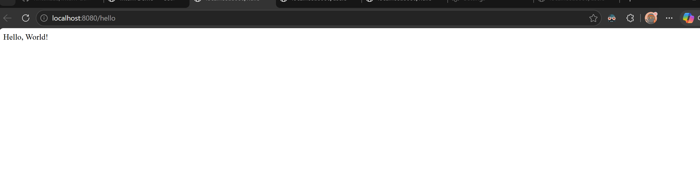
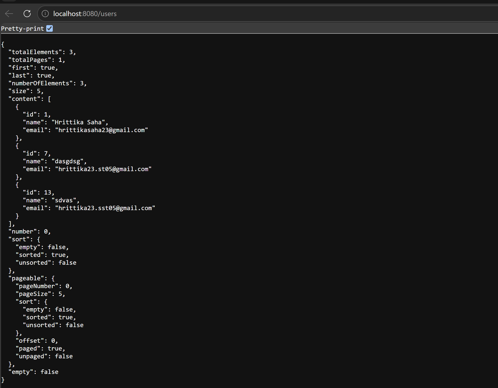

# Intern Demo — Spring Boot User Management

A full-stack Spring Boot application built as part of an internship assignment. It exposes a RESTful API for managing users backed by a PostgreSQL database, and serves a custom dark-theme frontend for full CRUD interaction.

---

## 📸 Screenshots

### 1. `/hello` Endpoint


*Figure 1: The `GET /hello` endpoint returning a plain-text response in the browser.*

### 2. User Management UI (DB connection proof)


*Figure 2: The dark-theme UI successfully listing users fetched from PostgreSQL.*

---

## ✨ Features

| Feature | Detail |
|---|---|
| **Hello Endpoint** | `GET /hello` returns `"Hello, World!"` |
| **User CRUD** | Full Create / Read / Update / Delete via REST |
| **PostgreSQL** | Persistent storage with Spring Data JPA |
| **Pagination** | Backend-driven pages (default 5 per page) via Spring `Pageable` |
| **Validation** | `@NotBlank`, `@Email`, unique-email check — all enforced server-side |
| **Error Handling** | `@RestControllerAdvice` returns structured JSON error responses |
| **Dark UI** | Vanilla HTML/CSS/JS frontend with toast notifications |
| **API Explorer** | Built-in Endpoints tab to test `/hello` and `/users` live |
| **Secure Config** | DB credentials stored in a gitignored local properties file |

---

## 🗂️ Project Structure

```
src/
└── main/
    ├── java/com/demo/intern_demo/
    │   ├── InternDemoApplication.java      # Entry point
    │   ├── controller/
    │   │   ├── HelloController.java        # GET /hello
    │   │   ├── UserController.java         # CRUD /users
    │   │   └── GlobalExceptionHandler.java # Validation error mapper
    │   ├── model/
    │   │   └── User.java                   # JPA entity (id, name, email)
    │   ├── repository/
    │   │   └── UserRepository.java         # JpaRepository + findByEmail
    │   └── exception/
    │       └── DuplicateEmailException.java
    └── resources/
        ├── application.properties          # Safe config (committed)
        ├── application-local.properties    # Real credentials (gitignored)
        └── static/
            └── index.html                  # Frontend UI
```

---

## 🔌 API Endpoints

| Method | Path | Description | Body |
|--------|------|-------------|------|
| `GET` | `/hello` | Returns `"Hello, World!"` | — |
| `GET` | `/users?page=0&size=5` | Paginated list of users | — |
| `POST` | `/users` | Create a new user | `{ "name": "...", "email": "..." }` |
| `PUT` | `/users` | Update an existing user | `{ "id": 1, "name": "...", "email": "..." }` |
| `DELETE` | `/users` | Delete a user by ID | `{ "id": 1 }` |

### Validation Rules
- `name` — must not be blank
- `email` — must be a valid email format and **unique** across all users

### Error Response Format
```json
{
  "email": "Email is already in use"
}
```

---

## 🛠️ Tech Stack

- **Backend**: Java 23 · Spring Boot 3.3 · Spring Data JPA · Hibernate
- **Database**: PostgreSQL 18
- **Validation**: Jakarta Bean Validation (`spring-boot-starter-validation`)
- **Frontend**: Vanilla HTML · CSS · JavaScript (no frameworks)
- **Build**: Maven Wrapper (`mvnw`)

---

## ⚙️ Setup & Installation

### Prerequisites
- Java 17 or higher
- PostgreSQL installed and running locally
- Maven (or use the included `mvnw` wrapper)

### 1. Clone the repository
```bash
git clone https://github.com/hrittikaaa/intern-demo.git
cd intern-demo
```

### 2. Create the PostgreSQL database
```sql
CREATE DATABASE intern_demo;
```

### 3. Configure credentials
Create the file `src/main/resources/application-local.properties` (already gitignored):
```properties
spring.datasource.url=jdbc:postgresql://localhost:5432/intern_demo
spring.datasource.username=your_username
spring.datasource.password=your_password
```

### 4. Run the application
```bash
./mvnw spring-boot:run
```

The app will start on **http://localhost:8080**

> **Tip:** The terminal will stay open — that's normal for a server process. Press `Ctrl+C` to stop it.

---

## 🔒 Credential Security

DB credentials are **never hardcoded** in `application.properties`. The committed file uses environment variable placeholders:

```properties
spring.datasource.password=${DB_PASSWORD:}
```

The real values live in `application-local.properties`, which is listed in `.gitignore` and never pushed to GitHub.

---

## 📚 Learning Outcomes

This project was built to demonstrate:
- Setting up a Spring Boot project from scratch using Spring Initializr
- Connecting to and querying a PostgreSQL database with JPA/Hibernate
- Building a REST API with proper HTTP methods and status codes
- Implementing server-side validation and global exception handling
- Serving a static frontend from within a Spring Boot app
- Managing secrets and credentials securely with gitignored config files
