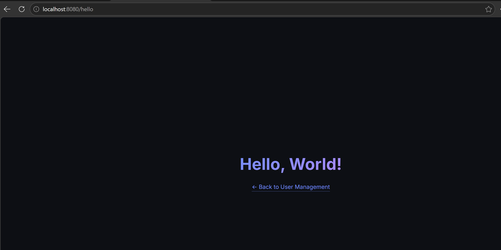
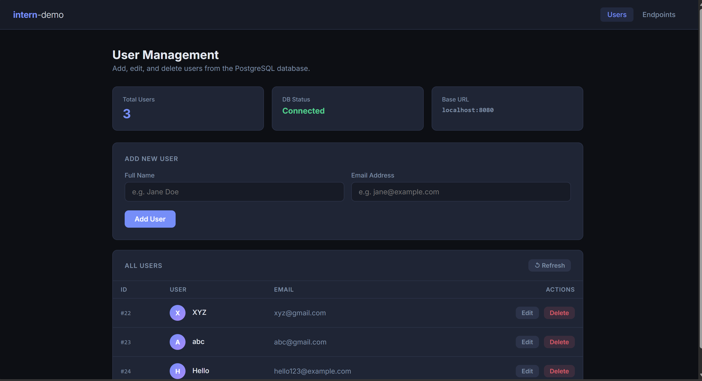
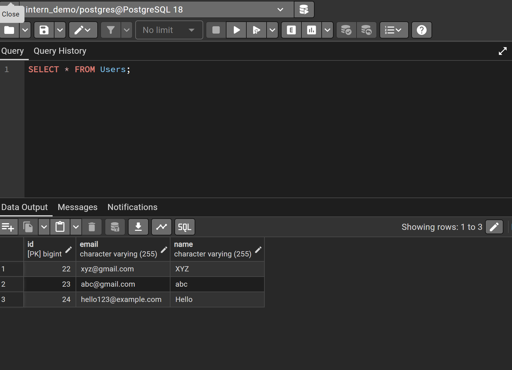

# Intern Demo — Spring Boot User Management

A full-stack Spring Boot application built as part of an internship assignment. It uses Spring MVC and Thymeleaf for server-side rendering to provide full CRUD interaction for managing users backed by a PostgreSQL database.

---

## 📸 Screenshots

### 1. `/hello` Endpoint


_Figure 1: The `GET /hello` endpoint returning a greeting page in the browser._

### 2. User Management UI


_Figure 2: The frontend displaying live users fetched from PostgreSQL, with stats cards and full CRUD controls._

### 3. PostgreSQL Query Verification


_Figure 3: `SELECT * FROM Users` run in pgAdmin confirming the same users are persisted directly in the database._

### 4. `/users` Endpoint


_Figure 4: The `GET /users` endpoint returning a Thymeleaf-rendered table of all users._

---

## ✨ Features

| Feature            | Detail                                                               |
| ------------------ | -------------------------------------------------------------------- |
| **Hello Endpoint** | `GET /hello` renders a greeting view, `/api/hello` returns text      |
| **User CRUD**      | Full Create / Read / Update / Delete via Thymeleaf HTML forms        |
| **PostgreSQL**     | Persistent storage with Spring Data JPA                              |
| **Pagination**     | Backend-driven pages (default 5 per page) via Spring `Pageable`      |
| **Validation**     | `@NotBlank`, `@Email`, unique-email check — all enforced server-side |
| **Error Handling** | `@ControllerAdvice` maps errors to Thymeleaf flash attributes        |
| **Dark UI**        | Clean HTML/CSS templates rendered dynamically by Thymeleaf           |
| **API Explorer**   | Built-in Endpoints tab to explore available routes                   |
| **Secure Config**  | DB credentials stored in a gitignored local properties file          |

---

## 🗂️ Project Structure

```
src/
└── main/
    ├── java/com/demo/intern_demo/
    │   ├── InternDemoApplication.java      # Entry point
    │   ├── controller/
    │   │   ├── HelloController.java        # GET /hello routes
    │   │   ├── UserController.java         # POST form submissions for CRUD
    │   │   ├── ViewController.java         # GET page rendering routes
    │   │   └── GlobalExceptionHandler.java # Validation & error handling
    │   ├── model/
    │   │   └── User.java                   # JPA entity (id, name, email)
    │   ├── repository/
    │   │   └── UserRepository.java         # JpaRepository + findByEmail
    │   └── exception/
    │       └── DuplicateEmailException.java
    └── resources/
        ├── application.properties          # Safe config (committed)
        ├── application-local.properties    # Real credentials (gitignored)
        └── templates/
            ├── index.html                  # Main User CRUD view
            ├── endpoints.html              # Endpoints directory view
            ├── users.html                  # Read-only all users view
            └── hello.html                  # Hello greeting view
```

---

## 🔌 MVC Routes

| Method   | Path                   | Description                                  |
| -------- | ---------------------- | -------------------------------------------- |
| `GET`    | `/`                    | Renders main User Management page            |
| `GET`    | `/endpoints`           | Renders Endpoints directory                  |
| `GET`    | `/users`               | Renders a read-only list of all users        |
| `GET`    | `/hello`               | Renders Thymeleaf greeting page              |
| `GET`    | `/api/hello`           | Returns plain-text `"Hello, World!"`         |
| `POST`   | `/users`               | Form submission to create a new user         |
| `POST`   | `/users/{id}`          | Form submission to update an existing user   |
| `POST`   | `/users/{id}/delete`   | Form submission to delete a user by ID       |

### Validation Rules

- `name` — must not be blank
- `email` — must be a valid email format and **unique** across all users

### Error Handling

Validation errors and success messages are passed to views using `RedirectAttributes` as flash attributes, displaying toast notifications in the UI.

---

## 🛠️ Tech Stack

- **Backend**: Java 23 · Spring Boot 3.3 · Spring Data JPA · Hibernate
- **Database**: PostgreSQL 18
- **View Layer**: Thymeleaf
- **Validation**: Jakarta Bean Validation (`spring-boot-starter-validation`)
- **Frontend**: HTML · Vanilla CSS (no frameworks)
- **Build**: Maven Wrapper (`mvnw`)

---

## ⚙️ Setup & Installation

### Prerequisites

- Java 17 or higher
- PostgreSQL installed and running locally
- Maven (or use the included `mvnw` wrapper)

### 1. Clone the repository

```bash
git clone https://github.com/hrittikaaa/intern-demo.git
cd intern-demo
```

### 2. Create the PostgreSQL database

```sql
CREATE DATABASE intern_demo;
```

### 3. Configure credentials

Create the file `src/main/resources/application-local.properties` (already gitignored):

```properties
spring.datasource.url=jdbc:postgresql://localhost:5432/intern_demo
spring.datasource.username=your_username
spring.datasource.password=your_password
```

### 4. Run the application

```bash
./mvnw spring-boot:run
```

The app will start on **http://localhost:8080**

> **Tip:** The terminal will stay open — that's normal for a server process. Press `Ctrl+C` to stop it.

---

## 🔒 Credential Security

DB credentials are **never hardcoded** in `application.properties`. The committed file uses environment variable placeholders:

```properties
spring.datasource.username=${DB_USERNAME}
spring.datasource.password=${DB_PASSWORD}
```

The real values live in `application-local.properties`, which is listed in `.gitignore` and never pushed to GitHub.

---

## 📚 Learning Outcomes

This project was built to demonstrate:

- Setting up a Spring Boot project from scratch using Spring Initializr
- Connecting to and querying a PostgreSQL database with JPA/Hibernate
- Building a complete Spring MVC application with Thymeleaf templates
- Handling form submissions, data binding, and redirects
- Implementing server-side validation and global exception handling
- Managing secrets and credentials securely with gitignored config files
